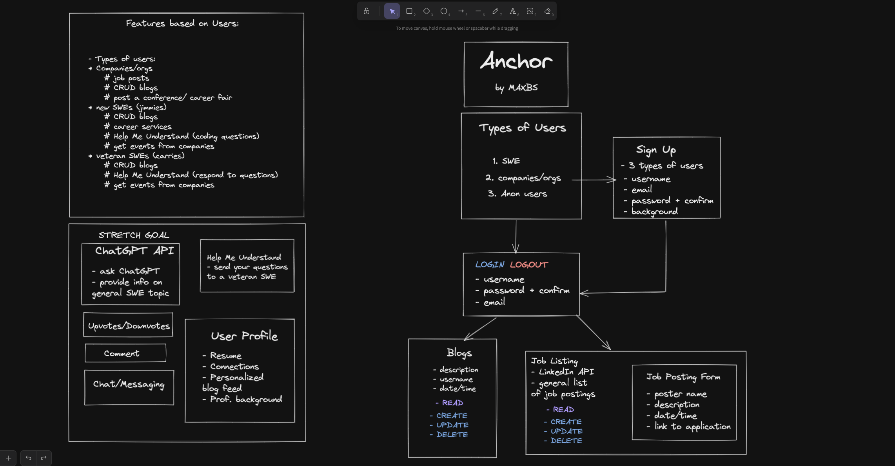
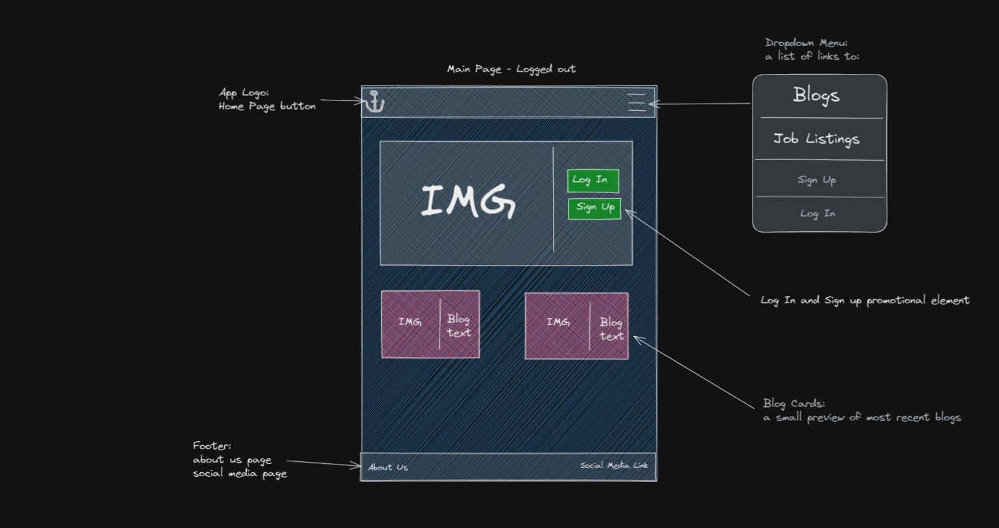
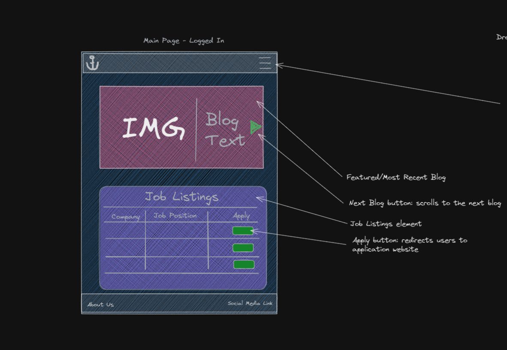
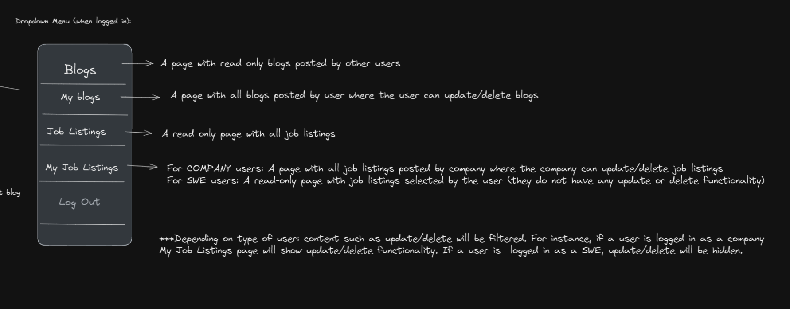
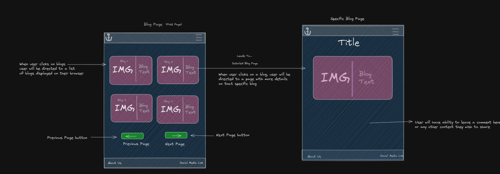
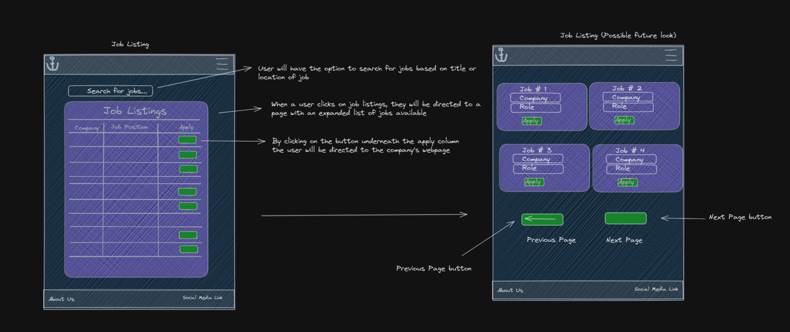
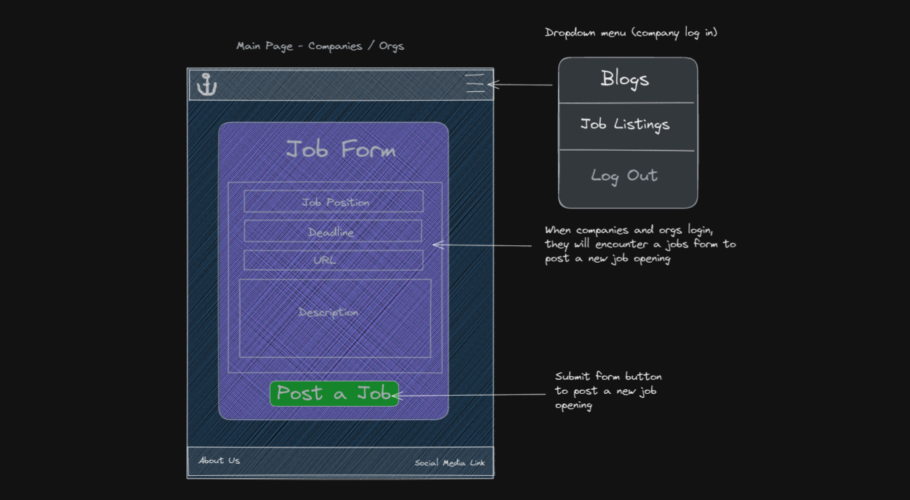

## Wireframe
- This represents they structure of each page and how we would want our app to be designed:

## Landing Page - Logged Out

- Upon arrival to the landing page, the user will by default be signed out. This will be what they see on their browser:
- User will have the ability to log in or sign up.
- They will also be able to see a list of 3 of the most recent blogs that were posted by any user.

---

## Landing Page - Logged In

- Once the user is logged in, either through sign up or log in. This will be what they see on their browser:
- The user will be able to see a list blogs
- The user will be able to see a truncated version of job listings available

---

## NavBar

- The burger icon located on the right side of the page represents the dropdown menu.
- If the user is logged in they will be able to navigate to certain parts of the website.
- This is what the dropdown menu should look like once the user is logged in:

---

## Blog Listing and Specific Blog

- Once a user is logged in they will be able to see a list of all their blogs.
- Once they click on a blog, they will be directed to that specific blog.
- This is what the user will see once they are in their blogs list page as well as their specific blog page:

---

## Job Listing

- Once a user is logged in they will have access to a list of jobs posted by companies.
- The user will be able to apply to any job by clicking on the apply button.
- If logged in, this is what their job listing page will display:

---

## Create Job

- If a user has a the role of "company" they will be able to create a job listing.
- The display for that user will look like this:

